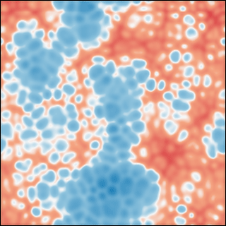

# Pseudo-Spectral Implementation of a 2d ETDRK4 Scheme
The numerical algorithm implemented in the module `ETDRK4.f90` can be used to perform a numerical integration of a spatially two-dimensional partial differential equation (pde) based on the fftw3-library. The ETDRK4 scheme [1,2] is especially suited to solve equations with stiffness in the linear part, i.e. high order spatial derivatives. Two examples of this kind of pde are implemented, damped versions of the Kuramoto-Sivashinsky equation (KSE) as well as Nikolaevskiy equation (NE).



This simulation uses a pseudo-spectral approach meaning that the equation is solved in Fourier space while nonlinear contributions are calculated by transforming back and forth between real and Fourier space. The boundary conditions are therefore periodic. The Fourier transformations involved here are executed by means of the fftw3-library. See below for a brief description on how to implement a different model.

## Compilation

This program requires that the fftw3 library is installed. Compile using for example
   ```console
   $ gfortran fftw2d.f90 ETDRK4.f90 main.f90 -lfftw3 -o run -O3
   ```
for the GNU compiler.

## Module Initialization
The solver module is initialized by calling `initETDRK4(..)`. Here, aside from discretization parameters a model identifier as well as control parameters are getting passed over. Afterwards the the actual solver routine `step(..)` becomes available. 

## Initial Condition
The current simulation data is stored in the two arrays `real_data` and `freq_data` for real and Fourier space, respectively, in a matrix format (first index x or kx and second index y or ky, the Fourier components are arranged as described in the documentation of fftw3). These arrays can be manipulated as desired inbetween calls to the `step(..)`-routine. Note, however, that when calling the `step(..)`-routine the array `freq_data` is required to contain the current field. Thus, any initialization performed on the `real_data` array (in which the current field is stored in real space) has to be transformed first for example by using the method `dfft(..)` from the `FFTW2d`-helper module (see also the routine `perturbation(..)` given in the ETRK4-module as an example).

## Output Results
There are different procedures implemented for outputting the resulting simulation data. A real space-array can be written to a data file by calling `snapshot(..)`, a Fourier space-array on the other hand can be written by calling `snapshotf(..)` where additionally it has to be specified which information should be written (real/imaginary part, absolute value, or phase) by providing the corresponding identifier. The data is written in a matrix format. Finally, an upscaled (higher resolution) data array can be generated by using the routine `upscaledfield(..)` on a Fourier space input. Coupled with the `idfft(..)`-function from the helper module an upscaled real space field can be written (see also the example in `main.f90`). The standard output-directory is the `data/` subdirectory.

## Restoring Previous Result
Loading a real space backup file created with `snapshot(..)` is possible by calling `initfromfile(..)`. Note that the module has to be initialized first and the parameters are required to be compatible with the state that is supposed to be restored.

## Implementation of New Models
Implementing a different model for this solver requires changes at different points in the source code. First, a new identifier has to be assigned at the beginning of the routine `initETDRK4(..)` (case selection for `modelid0`). In a second step the linear part of the pde has to be entered a little later in the same method (case selection for `modelid`). Lastly, the nonlinear part needs implementation. This is achieved in modifying the function `getNonlinearity(..)` accordingly. The fftw3 plans used here for the examples are not required (in principle also the `dfft(..)` and `idfft(..)` routines could be used) but are highly recommended for better performance. Note that all `dfftw_execute_..` calls need to have exactly the format given here and data from other arrays possibly needs to be copied beforehand. Furthermore, execution of a `.._c2r` plan generally destroys the complex input data (again, see documentation of fftw3).

[1] Cox, Steven M., and Paul C. Matthews. "Exponential time differencing for stiff systems." Journal of Computational Physics 176.2, 430-455 (2002).

[2] Kassam, Aly-Khan, and Lloyd N. Trefethen. "Fourth-order time-stepping for stiff PDEs." SIAM Journal on Scientific Computing 26.4 1214-1233 (2005).
